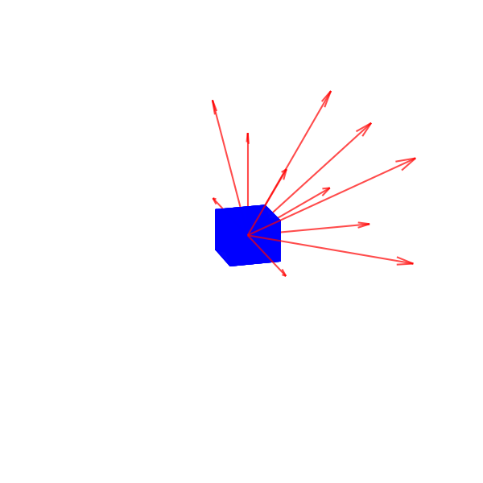

NOTE THIS README.MD HAS BEEN CREATED CONVERTING A LATEX FILE, AND HAS NOT BEEN CORRECTED

*“Chess is not a game. Chess is a well-defined form of computation. You
may not be able to work out the answers, but in theory there must be a
solution, a right move in any position. ”*

[^1]

# Introduction

The game of Tic-Tac-Toe, particularly its generalized version, is part
of a broad category of games classified as complete information games.
This class of games has long been overlooked by classical mathematical
game theory, which primarily focuses on incomplete information games
such as Poker or card games. Classical game theory develops
probabilistic methods, such as the minimax theorem for mixed strategies,
to determine optimal moves. However, these methods are impractical for
games with a combinatorial complexity on the order of Shannon numbers or
higher (we call this combinatorial chaos).  
The minimax method, employed by us as the “perfect player” in the case
of 3x3, becomes unusable when extended to 3x3x3, where the computational
times for a move easily exceed 20 minutes. Consequently, it becomes
imperative to explore new approaches. One approach, specifically
developed for complete information games is the “Theory of Nim-like
Compound Games”. This theory can explain and solve various games
(Bouton, Sprague, Grundy, Berlekamp, Conway, Guy, ...) by decomposing
them into a sum of subgames that can be easily assessed through
algebraic techniques.  
While this approach is effective for simple games or endgames in more
complex games like Go or Chess, it fails when the game becomes
intricate, primarily due to the inability to evaluate positions that are
no longer evaluable as simple sums of basic subgames. In essence, none
of the previously described approaches can provide precise methods when
dealing with combinatorial chaos.  
To overcome this theoretical limitation, József Beck developed a novel
approach known as the "Fake Probabilistic Method." This method,
involving randomization (via Erdos’ theory) and derandomization through
the definition of potentials, constructs efficient (*polynomial time*)
optimization algorithms. Our research can be considered a hybrid between
the Nim-like and Fake-probabilistic approaches. Starting with the
construction of an energy function (conceptually analogous to the
potential), we define an evaluation function capable of determining,
based on the current state of the board, the move that minimizes the
energy thus defined.  
Therefore, we assess the game by decomposing it (as we will demonstrate,
the total energy is a sum of “line” energies), akin to Nim-like cases.
However, its evaluation is comprehensive, evaluating what is known in
statistical mechanics as a macrostate rather than individual
microstates, implying an underlying statistical assumption. Finally, the
methodology used to define energy draws inspiration from the Ising
model, inherently statistical in nature.

# The definition of a consistent C++ library for generalized Tic-Tac-Toe

## What does it mean multidimensional board?

It is evident that to engage in a generalized form of Tic-Tac-Toe, one
must possess a board that is as general as possible. We can represent
the board as an object with only two static parameters: the dimension,
`dimension`, indicating whether the game is played on a plane, in a
volume, or in a hyper-volume; and the number of cells, `cell``number`,
representing the discrete extent of the board in each direction. Lastly,
there must exist a non-static parameter, which will vary throughout the
course of the game, and this is none other than the state of the board,
denoted as `grid`.  
In mathematics, this object is referred to as a tensor of type
(`dimension`,0); however, it is not well definable as such in C++. This
is because using `std::vector` for a dynamic definition with recursive
structures is not feasible; i.e., it is not possible to accomplish the
following:
`std::vector` \< `std::vector` \< `std::vector` \< …`std::vector` \< `state` \> … \>  \> \>
Where the number of pairs of angle brackets used is equal to the not
defined a priori dimension or rather not known to the compiler.
Therefore, the only way is to define a single vector,
`std::vector<state>`, with a size equal to
`cell``number``dimension`, resulting in the following
correspondence:  
      
Where `dimension` has been referred to as *h*, and `cell``number` as *n*
for conciseness;  
  
;%20k%20\in%20K;)

%20=%20\sum_{m=0}^{n-1}%20\Vec{w}_l%20\cdot%20\Vec{e}_{m+1}%20\cdot%20m%20=%20\lambda_l)

  
An attentive observer will notice that by the definition of
*f**λ*, there is no guarantee that
*f**λ*(*w⃗**l*) is effectively constrained between
0 and *n**h* − 1. In reality, this occurs because, upon
careful reflection, vectors *w⃗**l* are discrete position
indicators along one direction; therefore, they will take on canonical
vector forms times a scalar *δ* ∈ \[0,…,*n*−1\]. So that
$\max\_{\delta_i\in \Delta} \sum\_{i=0}^{h-1} \lambda_i(\delta_i) \cdot n^i = (n-1)+(n-1)\cdot n+\ldots +(n-1)\cdot n^{h-1} = (n-1)\cdot \sum\_{i=0}^{h-1} n^i = n^h -1$.
Let us now clarify the meaning of `state`. As defined, the game board is
a hypergrid, where each cell can represent one of the three possible
states: `X`, `O`, or empty. Therefore, `state` is defined as an
`enum class state {X,O,N}` and thus the previous definition of the
vector T is, in fact, general-purpose.

## What does it mean multidimensional win?

The real complexity in defining a consistent C++ library comes from the
definition of a multidimensional win. What does it mean
“multidimensional win”? Arguably, the simplest definition of
multidimensional victory is that a game is considered multidimensionally
won, or rather the global state of the board (`grid`) is in a winning
state, if there exists at least one segment of length `cell``number` in
which all cells have the same non-`N` `state`.  
In practical terms, this means that we need to find one of the many,
possibly the best, computational ways to implement this check. How to do
it? On the surface, it may seem conceptually straightforward, but it
conceals quite a few challenges.

### The need for a directions library

To apply the given definition of multidimensional victory, there are
indeed multiple approaches; ours starts from the abstraction of the
segment to a line, or rather, to a direction. In fact, stating that
there exists at least one segment of length `cell``number` where all
cells have the same non-null `state` is equivalent to asserting that, by
starting from every non-empty *h*-dimensional cell and checking all its
acceptable directions, we will find that at least once, in one of the
directions, we have exactly `cell``number` cells with a state equal to
that of the starting cell.  
How can we derive all the directions and what does it mean "acceptable
directions"? The first question has a relatively straightforward, albeit
not unique, answer. Representing directions as vectors for conceptual
convenience, the possible directions are nothing more than the possible
arrangements of 1 and 0 in a sequence of size `dimension`.
Unfortunately, this alone is not sufficient. In an initial version, we
attempted to use these directions, only to realize that some winning
possibilities are tragically overlooked (consider, for example, the 3x3
case and the direction (1,−1) corresponding to the diagonal from the
bottom-left cell to the top-right cell). So, instead of considering only
the directions, we have considered all possible linear combinations of
the directions themselves and their opposite vectors, namely all
possible arrangements of 1,  − 1, and 0 in a sequence of size
`dimension`. We then developed a method that could be called
“*hairdressing*”: we let the “hair” grow, constructing all possible
directions and orientations, and subsequently cut them by customizing
them differently for each block—essentially removing all directions that
are not acceptable
\[Fig.<a href="#fig:general" data-reference-type="ref"
data-reference="fig:general">5</a>\].

<figure id="fig:general">
<figure id="fig:fig1">

<figcaption>Cube of the inside grid with no <em>hair
cut</em></figcaption>
</figure>
<figure id="fig:fig2">

<figcaption>Corner cube <em>hair cut</em></figcaption>
</figure>
<figure id="fig:fig3">

<figcaption>Edge cube <em>hair cut</em></figcaption>
</figure>
<figure id="fig:fig4">

<figcaption>Plane cube <em>hair cut</em></figcaption>
</figure>
<figcaption>Possibles <em>hair cuts</em> in a three-dimensional
Tic-Tac-Toe</figcaption>
</figure>

#### The “*hairdressing*” method

The first and most immediate thing is to construct the starting case,
namely all possible directions generated by arrangements of 1,  − 1, and
0 in a sequence of length `dimension`. To do this, we have defined in
the `directions.h` library the two functions `comb``gen` used by
`k``comb``gen` in order to return an `std::vector<std::vector<int>>`
that contains all the directions. Subsequently, in order to correctly
select the directions based on the cell, we engage in some reasoning.
Firstly, we intuit that cuts occur for non-internal but
hyper-superficial cells, and therefore, we need to characterize those.
We also observe that the grid, as defined, is a simple vector, so there
is no a priori way to know whether a cell is extremal or not. Indeed,
since the cells are numbered progressively, as seen in the tensor
redefinition, their index representation corresponds to a numerical
representation in base `cell``number`. To devise a classification method
from these considerations, we introduce the concept of a *limit number*,
which is the number whose corresponding cell is extremal along that
direction[^2]. For example, in a 3x3x3 grid (bearing in mind that
counting starts from 0), 2 is extremal for directions *x*0,
*x*1 and *x*3 while 1 is extremal only for
*x*1 and *x*3.

0.3

|  0  |     |  2  |
|:---:|:---:|:---:|
|  3  |     |  5  |
|  6  |     |  8  |

*limit numbers* for *x*1 in 3 × 3

<figure>

</figure>

0.3

|  0  |  1  |  2  |
|:---:|:---:|:---:|
|     |     |     |
|  6  |  7  |  8  |

*limit numbers* for *x*1 in 3 × 3

After a careful analysis of these numbers, we have identified this
relationship, which is easily demonstrable but, because not of specific
interest, we have omitted here (we will attach it in the future):
$$i \in \textit{limit number} \\x_j\\ \iff \exists \\ a \mid i \equiv a \\(\text{mod. } \text{\texttt{cell}\textunderscore\texttt{number}}^{j+1}) \\ a \in C_j^{\textbf{up}} \cup  C_j^{\textbf{down}}$$
  
where
$C\_{j}^{\textbf{down}} = \\c \mid c = \text{\texttt{cell}\textunderscore\texttt{number}}^{j} - f -1, \forall f \in \mathbb{N} \cap \[0, \text{\texttt{cell}\textunderscore\texttt{number}}^{j}-1\] \\$
while  
$C\_{j}^{\textbf{up}} = \\c \mid c = \text{\texttt{cell}\textunderscore\texttt{number}}^{j+1} - f - 1, \forall f \in \mathbb{N} \cap \[0, \text{\texttt{cell}\textunderscore\texttt{number}}^{j}-1\] \\$  
  
In order to formalize this concept into a function, we have defined
`std::vector<std::vector<int>> constrains (cell``number, dimension)`.
This function returns nothing more than the set of all possible
*C**j***down** and
*C**j***up**, i.e.,
`constrains` = \[*C*0**down**,*C*1**down**,…,*C*`dimension` − 1**down**,*C*0**up**,*C*1**up**,…,*C*`dimension` − 1**up**\]  
Now that we have a way to determine the *hairstyles*, we need to
introduce two ancillary functions, to effectively cut the directions.
The first function, `zero``cut`, removes null vector directions while
the second,
`j``a``remover(std::vector<std::vector<int>>`&` source, int j, int a)`,
removes from the collection of vectors `source` all vectors with a
`j`th component equal to `a`, effectively constituting the
true *razor* function.  
  
We can now comprehensively illustrate the “*hairdressing*” method:

1.  Generate all directions and *limit numbers* indexed as described
    above:

    1.  Generate all directions:

                std::vector<std::vector<int>> all_directions = k_comb_gen(dimension);

    2.  Remove null direction:

                all_directions = zero_cut(all_directions);

    3.  Generate limit numbers:

                std::vector<std::vector<int>> limit = constrains(cell_number, dimension);

2.  For each block *i*, check if *i* belongs to an upper or lower *limit
    number*. In that case, proceed to remove all directions with a
    component, respectively, of either 1 or  − 1 along the component
    identified by the limit number:

    1.  Copy the directions in order to cut them:

                std::vector<std::vector<int>> directions = all_directions; 

    2.  Perform the cut:

            for (int k=0; k<static_cast<int>(limit.size()); k++) {
               9 for (size_t f=0; f<limit[k].size(); f++) {
                    if (k_module(int_pow(cell_number,k+1-dimension),i)==limit[k][f] && k>=dimension) {
                        directions = j_a_remover(directions,k-dimension,1);
                    }
                    else if (k_module(int_pow(cell_number,k+1),i)==limit[k][f] && k<dimension) {
                        directions = j_a_remover(directions,k,-1);
                    }
                }
            }

### How to “`check``win`”

Once a robust method for identifying acceptable directions is developed,
we are close to describing a coherent approach to verify winning in a
hypergrid. However, to do so, we must first transition from the
classical vector representation in a tensor of directions to a scalar
representation in a vector (as previously discussed). Therefore, we
define the method `numeric``directions(cell``number, source)`, which
does nothing more than taking all direction vectors
*x**m* = (*λ*0*m*,…,*λ**h* − 1*m*)
and transform them, similarly to what has been discussed with the
substantial difference that *λ**i**m* ∈ {0, 1},
into the corresponding integer scalar
*λ**m* = *λ*0*m* + *λ*1*m* ⋅ *n* + …*λ**h* − 1*m* ⋅ *n**h* − 1,
where we recall that *h* = `dimension` and
$n=\texttt{cell}\textunderscore\texttt{number}$.  
Finally, we can define
`check``win(std::vector<state> grid, int cell``number, int dimension)`,
which has been characterized as a simple boolean function (in a
two-player game, the parity or oddity of the turn already determines the
winner):

1.  As a first step, we initialize the necessary variables, which
    include those previously discussed for the “*hairdressing*” method,
    and an integer vector required to store the scalar directions:

    1.  Calculating the dimension of the grid:

                int tot_dim = int_pow(cell_number,dimension);

    2.  Initializing “*hairdressing*” variables:

                std::vector<std::vector<int>> limit = constrains(cell_number,dimension); 
                std::vector<std::vector<int>> start_directions = k_comb_gen(dimension);
                start_directions = zero_cut(start_directions);

    3.  Initializing the new variables, where `player` is needed to
        check the win for both players and will used as a control:

                std::vector<int> n_directions;
                state player = state::O;

2.  We now implement a while loop that will terminate when the `player`
    variable assumes an impossible value (i.e., `state::N`) and will
    check for a win for the two possible players:

3.  Starting the while and performing the “`hairdressing`” method:

            while (player!=state::N) {
            for (int i=0; i<tot_dim; i++) {
                std::vector<std::vector<int>> directions = start_directions;
                    if (grid[i]==player) {
                        for (int k=0; k<static_cast<int>(limit.size()); k++) {
                                for (size_t f=0; f<limit[k].size(); f++) {
        if (k_module(int_pow(cell_number,k+1-dimension),i)==limit[k][f] && k>=dimension)
        {directions = j_a_remover(directions,k-dimension,1);}
        else if (k_module(int_pow(cell_number,k+1),i)==limit[k][f] && k<dimension)
        {directions = j_a_remover(directions,k,-1);}
                            }}

4.  Now, we transform the directions into scalar directions, and
    starting from the *i*-th cell, we check, for each acceptable
    direction, if there is one where there are `cell``number` cells with
    the same state of the *i*-th one, using the `line``check` function.
    Given the `grid`, `cell``number`, one direction, the starting cell
    number, the original vector direction, and the *limit numbers*
    `line``check` returns `true` if there is a win in that direction or
    `false` in all the other cases:

            n_directions = numeric_directions(cell_number,directions);
            for (size_t k=0; k<n_directions.size(); k++){
                if (grid[i+n_directions[k]]==player &&
                line_check(grid,cell_number,dimension,n_directions[k],i,directions[k],limit))
                    {
                        return true;
                    }}

5.  We now end the function in order to repeat the check for the
    `state::X` and to give a `false` return in all other cases:

    1.  Closing the `if (grid[i]==player)`

                    }

    2.  Closing the `for (int i=0; i<tot``dim; i++)`

                    }

    3.  Changing the state of `player` to verify and providing a proper
        termination of the function.

                if (player==state::O) {player=state::X;}
                else {player=state::N;}
                }
                return false;
            }\\end of check_win

## A rough analysis, the computation of all possible states

Our initial attempt, which we document here for anyone interested in
further exploration, involved analyzing all possible states (in the
cases of reduced total grid dimensions) in an effort to construct a
tree-diagram network and derive some applicable principles for
larger-dimensional cases. This attempt proved unsuccessful for us;
however, the study of various networks at reduced dimensions is
feasible, and in theory, it can certainly provide various insights.  
Clearly, to perform a comprehensive analysis of a network generated from
possible states, it is advantageous to use Python, specifically with
NetworkX. Therefore, it is necessary to establish a communicative bridge
between the two languages, namely by creating a well-structured .CSV
file.  
The functions developed to achieve this are: `Board::all``plays` (which
requires `generate``moves` and `removeDuplicateVectors`), `Board::End`,
`Board::setgrid`, and `areVectorsEquivalent`.  
Let’s begin by describing the function
`void generate``moves(std::vector<state> grid, int cell``number, int dimension, std::vector<std::vector<std::vector<state>>>& result, int move)`.
Starting from the other parameters, this function recursively modifies
`result` (hence the need for the `move` parameter), transforming it into
a container of all possible plays. In particular, given *i*, *j*, *k*
with `result[i][j][k]`, we have that *i* represents the total number of
moves made, *j* the number of possible configurations or grids after *i*
moves (including repeated ones), and *k* the specific cell of the
grid.  
The function
`void removeDuplicateVectors(std::vector<std::vector<std::vector<state>>>& history)`,
on the other hand, as the name suggests, performs a check on all *j*
`std::vector<state>` contained in `history[i]`, cyclically fixing *i*.
In the event that
`history[i][`*j**n*`] = history[i][`*j**m*`]`, it
removes one of the two from history, resulting in `history[i][j-u]`,
where *u* is the sum of the number of copies of vectors in
`history[i]`.  
As one might expect, therefore, the function `Board::all``plays()` is
defined as follows:

    std::vector<std::vector<std::vector<state>>> Board::all_plays() {
        std::vector<std::vector<std::vector<state>>> result; 
        generate_moves(grid, cell_number, dimension, result, 0);
        removeDuplicateVectors(result);
        return result;
    }

The function `Board::End()`, instead, is a char function that returns
`X`, `O`, or `-`, depending on whether the winner is `state::X`,
`state::O`, or if there is a tie. Its definition, again, is very
straightforward:

    char Board::End() {
        if (check_win(grid,cell_number,dimension)) {
        if (type_count(state::X,grid)>type_count(state::O,grid)){
            return 'X';
        }
        else if (type_count(state::X,grid)<=type_count(state::O,grid)) {
            return 'O';
        }
       }
       
        return '-';
    }

The function `void Board::setgrid(std::vector<state> new``grid)` is
self-explanatory, so we won’t even describe it, whereas for
`areVectorsEquivalent`, it is necessary to provide some additional
details. Since we remove copies of states (i.e., identical grids) via
`removeDuplicateVectors`, there will be states in what `all``plays`
returns that no longer have successors, even though they are not
terminal states (wins or ties). Therefore, it is necessary to introduce
a function that establishes an order between states, and this is where
`areVectorsEquivalent` comes in. It takes two grids as parameters and
returns true if the second is a possible immediate evolution (one move
more) and false otherwise:

    bool areVectorsEquivalent(const std::vector<state>& vec1, const std::vector<state>& vec2) {
        if (vec1.size() != vec2.size()) {
            return false;
        }
        for (size_t i = 0; i < vec1.size(); i++) {
            if (vec2[i] != state::N) {
                if (vec1[i] != vec2[i]) {
                    return false;
                }
            }
        }
        return true;
    }

By means of these functions, we have constructed a potential program
capable of generating a well-structured .CSV file. Initially, we
initialize a Board object using the usual notation
` Board palette(`*n*`, `*h*`)`, and then create a
`std::vector<std::vector<std::vector<state>>> history = palette.all``plays();`.
Cycling through the entire length of `history`, it is then possible to
write a file in which each row represents a state and is accompanied by
a representative number indicating its predecessor.

        std::ofstream file("TTT_n^h.csv");
            if (file.is_open()) {
        for (size_t j=0; j<history.size(); j++) {
            for (size_t k=0; k<history[j].size(); k++) {
            for (size_t i=0; i<history[j][k].size(); i++) {
                int link=0;
                    if (j!=0 && j!=1) {
                    for (size_t l=0; l<history[j-1].size(); l++) {
                        if (areVectorsEquivalent(history[j][k],history[j-1][l])){
                            link=l;
                        }
                    }

                    }

            if (i==8) {
                if (history[j][k][i]==state::X) {file<<"X;"<<link<<endl;}
                else if (history[j][k][i]==state::O) {file<<"O;"<<link<<endl;}
                else if (history[j][k][i]==state::N) {file<<"[ ];"<<link<<endl;}
            }
            else {
                if (history[j][k][i]==state::X) {file<<"X, ";}
                else if (history[j][k][i]==state::O) {file<<"O, ";}
                else if (history[j][k][i]==state::N) {file<<"[ ], ";}
            }

        }
        }   
        file<<"----------------------------- move n "<<j<<" ----------------------------"<<endl;
            }

            file.close();
            std::cout << "Data successfully written to the CSV file." << std::endl;
        } else {
            std::cerr << "Unable to open the file." << std::endl;
        }

<figure id="fig:network_tree">

<figcaption>The 3x3 network</figcaption>
</figure>

#### The NetworkX implementation

We attach in the appendix the small program used for creating a network
from a .CSV file as described above. Once the network is created, there
are many possibilities for use, however, it is essential to emphasize
that the computation of possible states and the resulting network, even
in the trivial case of 3x3, requires approximately 20 minutes.
Therefore, **this approach is feasible exclusively for reduced
dimensions**.Nevertheless, statistical evaluation of configurations and
examination of winning paths in specified dimensions may reveal game
patterns or overarching rules that can be extrapolated to larger
dimensions.

# The classical MiniMax approach

The classical approach in game theory to determine optimal artificial
intelligence is the MiniMax algorithm. While this algorithm, in its
simplest form, is slow and notably inefficient, it is for zero-sum games
(like Tic-Tact-Toe) theoretically perfect—meaning it is capable, with
infinite precision, of providing the best possible answer. In practice,
when coupled with appropriately defined evaluation functions, it has
historically proven highly effective (e.g., Deep Blue) and in fact
continues to be employed. The MiniMax algorithm endeavors to determine
the optimal move for a player in a turn-based game. In the case of
Tic-Tac-Toe, the objective is to either secure a win or, at the very
least, avoid a loss. Visualizing the game as a decision tree (see
Fig.<a href="#fig:network_tree" data-reference-type="ref"
data-reference="fig:network_tree">6</a>), where each node represents a
game state, and branches denote possible moves. The algorithm explores
this tree recursively, assessing potential outcomes for each move. At
the terminal nodes of the tree, an evaluation function assigns scores. A
win might receive a positive score, a loss a negative score, and a draw
a neutral score. These scores guide the algorithm’s decision-making
process.

#### The *α* − *β* pruning

Clearly, conducting a comprehensive evaluation through Minimax entails
assessing every potential game, which is an exponentially time-consuming
process. Although it is not possible to make it sub-exponential, it is
possible to reduce computation times by avoiding the evaluation of
certain branches in the decision tree. One of the most effective methods
for achieving this is through *α* − *β* pruning, which is based on the
concept that if an exceptionally good move exists, there is no need to
evaluate other moves that we already know cannot be equally good. At the
algorithmic level, this means keeping track of upper and lower bounds
(*α* and *β*) and by comparing the values of the nodes with *α* or *β*,
respectively, depending on whether it is the Max player or the Min
player, pruning the unnecessary computations, significantly reducing the
search space.

## Our implementation in C++

We started from the open-source work of George Seif , and using our
already defined functions we generalized it. Without preemptively
explaining why certain variables and functions had to be introduced, we
begin to describe them.  
Firstly we define the variables:

        #define WIN 100000           
        #define	DRAW 0                   
        #define LOSS -100000             
        #define AI_MARKER state::O       
        #define PLAYER_MARKER state::X  

In total, we have defined six functions, which, as we will see, are
extremely simple:

1.  `bool reduced``check``win(std::vector<state> grid, int cell``number, int dimension, state player)`,
    intuitively returns true if the `grid` is in a winning state for the
    specified player (unlike `check``win`, which does it for both
    possible states) and false otherwise. As one can imagine, it has the
    same implementation as `check``win`, excluding the while loop that
    allows the control of both states. Therefore, we omit the code.

2.  `bool board``is``full(std::vector<state> grid)`, which has a similar
    but different role. It returns false if there are still legal moves
    and true if there are none. Instead of using the complex mechanics
    of `check``win`, we simply count the number of cells with
    `state::N`. If the count is non-zero, it returns false; otherwise,
    it returns true. Again, since this is straightforward, we do not
    include the code.

3.  `state get``opponent(state player)`, is necessary to switch the
    state of a given variable to that of the opponent. This function is
    strictly necessary for a MiniMax algorithm but is also extremely
    simple; therefore, we do not present the code.

4.  `int get``board``state(std::vector<state> grid, int cell``number, int dimension, state player)`,
    which serves as an evaluation function. It returns, based on the
    actual winning state, the corresponding integer values defined
    earlier: `WIN`, `LOSS`, and `DRAW`. Depending on the variable state
    player, it checks by means of `reduced``check``win` whether the grid
    is a win for the player (`WIN`), if it is a win for the opponent
    (`get``opponent(player)` (`LOSS`), or if it is neither of the two
    cases (`DRAW`). The implementation has been described, so we omit
    it.

5.  `std::vector<int> get``legal``moves(std::vector<state> grid)`, also
    of easy intuition. It simply checks which cells are in `state::N`
    and returns a `std::vector<int>` of all the indices corresponding to
    those cells. Once again, the code needed to define this function is
    straightforward, so we do not include it.

6.  `std::pair<int, int> minimax``optimization(std::vector<state>& grid, int cell``number, int dimension, state marker, int depth, int alpha, int beta)`,
    which is the most important and the least trivial (being recursive)
    and that we will describe in detail:

    1.  First, we define and initialize two variables:
        `int best``move = -1` (i.e., an invalid move) and
        `int best``score = (marker == AI``MARKER) ? LOSS : WIN`, meaning
        `LOSS` if `marker == PLAYER``MARKER` and `WIN` if
        `marker == AI``MARKER`.

    2.  Now, the first thing we check is whether we are in a terminal
        node; in that case, we return using the evaluation function
        `get``board``state`:

                if (board_is_full(grid) || DRAW != get_board_state(..., AI_MARKER))
                {
                        best_score = get_board_state(grid, cell_number, dimension, AI_MARKER);
                        return std::make_pair(best_score, best_move);
                }

    3.  After obtaining the legal moves, i.e.,
        `std::vector<int> legal``moves = get``legal``moves(grid)`, we
        define a `for` loop for each integer value in `legal``moves`,
        exploring each possible move individually:

                std::vector<int> legal_moves = get_legal_moves(grid);

                for (size_t i = 0; i < legal_moves.size(); i++)
                {
                    int curr_move = legal_moves[i];
                    grid[curr_move] = marker; \\...

    4.  Now, we proceed to the maximization if it is the AI’s turn.
        Therefore, recursively, we call `minimax``optimization` to
        calculate the best score for the case `depth+1`, which we will
        call `score` . Subsequently, we compare it with the previously
        defined `best``score`, and if necessary we recalculate and
        modify its value. Finally, if we find that the best move in this
        branch is worse than the best move in the previous branch
        (through the comparison between *α* and *β*), then we cut it
        off. Thus:

                if (marker == AI_MARKER)
                    {
                    int score; 
                    score = minimax_optimization(..., PLAYER_MARKER, depth + 1, alpha, beta).first;
                    
                    if (best_score < score)
                        {
                        best_score = score - depth * 10;
                        best_move = curr_move; 
                        grid[curr_move] = state::N;
                        
                        alpha = std::max(alpha, best_score);
                        if (beta <= alpha) { break;}
                        }
                    }

    5.  We repeat the same procedure symmetrically for the case
        `marker != AI``MARKER`, this time minimizing:

                else{
                    int score;
                    score = minimax_optimization(..., AI_MARKER, depth + 1, alpha, beta).first;

                    if (best_score > score)
                        {
                        best_score = score + depth * 10;
                        best_move = curr_move;
                        grid[curr_move] = state::N;
                        
                        beta = std::min(beta, best_score);
                        if (beta <= alpha) {break;}
                        }
                    }

    6.  As a final step, we close the loop, remembering to remove the
        made move. Upon completion of the loop, we made the function
        return an `std::pair` of `best``score` and `best``move`:

                grid[curr_move] = state::N;
                } //cycle closing
                return std::make_pair(best_score, best_move);
            },

# The Ising-oriented approach

## Introduction to Ising model and Metropolis simulation

The Ising model is a theoretical model of statistical physics that
describes the magnetic behavior of a ferromagnetic material. Proposed by
Ernst Ising in 1925, the model represents a network of quantum spins on
a regular grid. Spins can take on only two values, typically +1 or -1,
representing the magnetization states ’up’ or ’down,’ respectively. The
interaction between neighboring spins promotes alignment, thereby
generating the formation of magnetic domains. The Metropolis algorithm,
a Monte Carlo method, is then employed for efficient simulation. It
initializes with a random spin configuration, proposes spin-flips,
accepts or rejects based on energy considerations (Hamiltonian), and
iterates to sample Boltzmann-distributed states.  
Practically using Ising model () one defines a so-called reduced or
dimensionless Hamiltonian of the Ising model as:
*H* =  − *T**β*∑*j**k**σ**j**σ**k* − *T**h*∑*j**σ**j*
Were *σ**j* it is defined in terms of classical spins taking
on the values  ± 1 on a cubic lattice. Subsequently, the Metropolis
algorithm employs the defined Hamiltonian to assess a spin-flip; if the
flip leads to a reduction in energy is favorable, it is then executed.
In cases where the spin-flip does not lead to an energy reduction, the
outcome depends on a random distribution function involving both the
initial energy and the final energy after the spin-flip. Specifically,
by defining $r = \exp(\frac{E^{i}-E^{f}}{T})$ and generating a random
number *x* uniformly distributed between 0 and 1, if *r* \> *x*, the
flip occurs; otherwise, no action is taken.

## The adaptations of the Ising model to Tic-Tac-Toe

Clearly, there are many evident similarities between the operational
environment of the Ising model, i.e., networks of nodes with two states,
and Tic-Tac-Toe, hence adapting such a model appears quite natural.
First, let’s acknowledge the differences, essential to understand how to
adapt the model:

1.  There are 3 states instead of 2

2.  For a given node, the conceptual advantage is derived not so much
    from the states of neighboring nodes but from the states of all
    nodes in line with the given node. To be even more precise, the
    advantage is cumulative, meaning that two nodes aligned with each
    other and having the same value as the starting node provide a
    greater advantage compared to two nodes aligned with the starting
    node having the same value but not aligned with each other.

3.  It is impossible not to make any state changes

From these considerations alone, we are able to adapt the model,
respectively:

1.  We must imply that for every *σ**j*, *j* ∈ {0, 1, 2}

2.  Instead of having a term
    ∑*j**k**σ**j**σ**k* we must have a
    term
    ∑*j**k**σ**j*∏*l* ∈ *A**k*ord(*l*) ⋅ *σ**l*,
    were *k* = *f*(*j*); *A**k* is a totally ordered finite
    set of indexes of all the nodes contained in the line of *k*-th
    direction and ord(*l*) represents the ordinal position in this set
    starting with 2 (indirectly counting *σ**j*). The reasons
    for adding the ord(*l*) term can be traced back to the progressive
    nature of the advantage

3.  In the final implementation of our algorithm, if it is not possible
    to find a move that minimizes the energy, we must ensure that it
    randomly chooses among all moves (if there is more than one) that
    minimize its increase.

What we said so far is helpful but not definitive. In particular, what
is unclear are the values that the various *σ*, *h*, *β*, and *T* should
take. It is for this reason that adapting this model, while natural, is
simultaneously polysemous and not equivocal. Determining the values for
these parameters modifies the type of adaptation and consequently the
final result. We have found that the most intuitive adaptation (among
those we considered) is also the one that yielded the best results.

#### The most intuitive adaptation

Associating the possible to states to the number as:
`state::X` → 0;  `state::O` → 1;  `state::N` → 2
the adaptation that we considered to be the most intuitive is the one
that sets *β**T* = 1, *h* = 0 and
*σ**i*2 = 1 ,  *σ**i**σ**j* = *δ**i**j*(1−*δ**i*2)(1−*δ**j*2) + *σ**j*(1−*δ**i*2) + *σ**i*(1−*δ**i*2)
Where *δ* is the Kronecker delta. In equation
(<a href="#dirac" data-reference-type="ref"
data-reference="dirac">[dirac]</a>) we chose to define the product
instead of providing explicit values for generality and to highlight the
fact that, more than a numerical choice, it is an algebraic decision. In
any case, the meaning of the equation is that the product of
*σ*0 and *σ*1 is always zero, the product of each
*σ* with itself is one, and the product between any *σ**i*
and *σ*2 leaves *σ**i* unchanged (unless *i* = 2,
in which case, as already mentioned, it becomes 1). Put even more
directly, considering that the total energy is the sum of contributions
calculated from all possible directions of all possible nodes if, in a
direction-line, we find even a single *σ**i* with *i* ≠ 2,
different from the *σ**j* of the starting node, then the
entire line-direction of that node does not contribute to the total
energy. Now in our analysis, for clarity of results and aesthetic
appeal, we made some numerical adjustments: observing that in a winning
line-direction, where all states are all equal non-`state::N`, any
multiplicative constant in the product part would be equivalent to
multiplying the entire line energy by the constant itself raised to the
power of `cell``number`, a.k.a *n*. We define this constant as
$c= \sqrt\[n\]{n+1}$ so that in the end, if we have a winning direction
*k*, the product in that direction, will result in
∏*l* ∈ *A**k*(ord(*l*)⋅*σ**l*⋅*c*) = *n*! ⋅ 1 ⋅ *c**n* = *n*! ⋅ (*n*+1) = (*n*+1)!.
So in the end equation (<a href="#hamiltonian" data-reference-type="ref"
data-reference="hamiltonian">[hamiltonian]</a>) in the most intuitive
adaptation becomes:
*H**T**T**T* =  − ∑*j**k**σ**j*(∏*l* ∈ *A**k**c*⋅ord(*l*)⋅*σ**l*)

## The use of the adapted Hamiltonian

In analogy with the Metropolis algorithm, having defined an energy for
the overall state of a Board object, or rather for grid, it is now
possible to determine the move that minimizes this energy. Clearly, the
energy is calculated after changing the state of a cell (in our case,
necessarily from `state::N`), and since there are two possible moves,
player or opponent, for clarity, we will say
*H**T**T**T*(player) if we are calculating the energy after a
player’s move and *H**T**T**T*(opponent) if we are
calculating the energy after an opponent’s move. Initially, only the
player’s energy was considered, but we found it to be too partial to
determine a winning move. Subsequently, we introduced the opponent’s
energy as an additive term to a so-called game energy:
*H**g**a**m**e* = *H**T**T**T**p**l**a**y**e**r*(player) + *H**T**T**T**o**p**p**o**n**e**n**t*(player)
Unfortunately, in this way, it became more convenient to leave some
directions open for the opponent, as expected, making the strategy
completely unsuitable. Upon reflection, the best way to construct a
useful game energy is to put ourselves in the shoes of both the player
and the opponent. Therefore, calculating their respective energies by
playing the same move once as the player and once as the opponent. Thus,
if we denote the ordinal number of the free cell whose state is being
modified as an argument of the game Hamiltonian, we obtain:
*H**g**a**m**e*(*i*) = *H**T**T**T**p**l**a**y**e**r*(player,*i*) + *H**T**T**T**o**p**p**o**n**e**n**t*(opponent,*i*)
The game energy thus defined has proven to be functional but imperfect.
Now it happens that in front of winning moves for the player, the AI
prefers to block moves of the opponent, which clearly makes the game
losing. This is since the two energies are considered of equal
importance when, in reality, the player is more interested in winning
than in preventing the opponent from winning. Therefore, we have
concluded that we should introduce a bias *b*, as a multiplicative
factor that reduces the energy of the opponent:
*H**g**a**m**e*(*i*) = *H**T**T**T**p**l**a**y**e**r*(player,*i*) + *b* ⋅ *H**T**T**T**o**p**p**o**n**e**n**t*(opponent,*i*)
After some trials, we found that the value of *b* = 0.647 is suitable.
This parameter is crucial, and most likely holds a deeper meaning
related to game theory that escapes this investigation. Nevertheless, we
attempted to analyze it to draw some conclusions.

## The C++ implementation

Thanks to the work already done, only three additional functions were
needed to implement what has been described: `double line``energy`,
`double Energy` and `int min``Energy`.  
  
Starting with `double line``energy`, as mentioned before, its definition
is strictly related to the adaption chosen. For this reason, we
introduced the parameter `char type` to encompass multiple definitions
and provide the user with the option to choose which definition to use.
We will describe the definition
(<a href="#adapted" data-reference-type="ref"
data-reference="adapted">[adapted]</a>) given by `char type = ’A’`
because the other definitions did not yield any promising results; maybe
we will attach them separately. Therefore, for `char type = ’A’` we
have:  
  
`long double line``energy (char type,std::vector<state> grid, int start,int cell``number, int dimension, int n``direction``k, std::vector<int> v``dir,state player,`  
`std::vector<std::vector<int>> constrain) { `

        long double unit;
        if (type=='A'){unit=pow((cell_number+1.0),(1.0/cell_number));}
        int u = n_direction_k;

Where `u` is introduced solely to rename `n``direction``k` for
convenience. Now follows a while loop, similar to the one seen in
`check``win`, where, however, cells with `state` equal to that of the
player and those with state equal to that of the opponent are separately
counted using `flag` and `anti``flag`. Note how this counting part is
valid in any implementation (not just in `type==’A’`):

        int flag=1;
        if (grid[start]==state::N) {flag=0;}
        int anti_flag=0;
         if (grid[start]==get_opponent(player)) {anti_flag=1;}
        while (player!=state::N){
             if (start+u>=static_cast<int>(grid.size()) || start+u<0){
                player=state::N;
             }
            else if (grid[start+u]==player) { 
                for (int i=0; i<static_cast<int>(constrain.size()); i++) {
                for (int j=0; j<static_cast<int>(constrain[i].size()); j++) {      
                if ((k_module(int_pow(cell_number,i+1-dimension),start+u)==constrain[i][j] 
                && i>=dimension)||(k_module(int_pow(cell_number,i+1),start+u)==constrain[i][j] 
                && i<dimension)) {
                        std::vector<int> check;
                        if (i>=dimension){check = canonic(dimension,i-dimension);}
                        else {check = inv_canonic(dimension,i);}
                        if (scalar_p(check,v_dir)>0) {
                        player=state::N;
                        j=constrain[i].size()-1;
                        i=constrain.size()-1;
                        }                
                    }   
                }}        
                u+=u;
                flag +=1;
            }
            else if (grid[start+u]==get_opponent(player) && player!=state::N){
                for (int i=0; i<static_cast<int>(constrain.size()); i++) {
                for (int j=0; j<static_cast<int>(constrain[i].size()); j++) {      
                if ((k_module(int_pow(cell_number,i+1-dimension),start+u)==constrain[i][j] 
                && i>=dimension)||(k_module(int_pow(cell_number,i+1),start+u)==constrain[i][j] 
                && i<dimension)) {
                        std::vector<int> check;
                        if (i>=dimension){check = canonic(dimension,i-dimension);}
                        else {check = inv_canonic(dimension,i);}
                        if (scalar_p(check,v_dir)>0) {
                        player=state::N;
                        j=constrain[i].size()-1;
                        i=constrain.size()-1;
                        } 

                    }   
                }}        
                u+=u;
                anti_flag +=1;
            } 
            else {player=state::N;}          
        }

In the last part, characterized by the choice of adaptation, the state
count is transformed into energy using the formula
(<a href="#adapted" data-reference-type="ref"
data-reference="adapted">[adapted]</a>):

        long double line_energy=1.0;
        for (double i=1; i<flag+1; i++) {
            if (type=='A') {line_energy = line_energy*unit*i;}
            \\...}
        if (anti_flag!=0) {line_energy=0;}
        return line_energy;
    }\\ end of line_energy

As for the `Energy` function, as intuitively understood, it simply sums
up all the line energies, where the challenge lies in identifying the
directions, as seen before. In this function, we decided to further
reduce the explored directions, enhancing the “*hairdressing*” method
through the ` hyper``constrains` function, which returns only the
directions along which there are `cell``number` cells[^3]. However, the
logic of the function is not different from that of `check``win`
therefore, to not weigh down the explanation, we won’t go further in the
description.  
  
Finally, what the pivotal function `int min``Energy` does is to return
the cardinal integer value of the cell corresponding to the best move.
To achieve this, the function will do nothing more than evaluate the
overall energy of the system according to
(<a href="#tot_energy" data-reference-type="ref"
data-reference="tot_energy">[tot_energy]</a>), making use of `Energy`,
which in turn will use `line``energy`, for each possible legal move,
storing the various values associated with the moves in a vector. Once
determined which energy value is the lowest, the function returns the
cardinal integer corresponding to the cell. It should be emphasized
that, as implemented, the case in which the total energy increases
regardless of the move is already implicitly handled, as it resolves to
the move that increases the total energy the least. Furthermore, for the
correctness of the results, a random choice has been added in the case
of multiple equal minimum values.

    int min_Energy(std::vector<state> grid,int cell_number, int dimension, state player, double bias) {
        long double init_energy = Energy(grid,cell_number,dimension,player,0.8,'A');
        std::vector<long double> energy_record;
        int tot_dim = int_pow(cell_number,dimension);
        for(int i=0; i<tot_dim; i++){
            if (grid[i]==state::N) {
                if (type_count(state::N,grid)==1){return i;}
                long double count=0;
                grid[i]=player;
                count=Energy(grid,cell_number,dimension,player,1.0,'A');
                grid[i]=state::N;
                grid[i]=get_opponent(player);
                count += bias*Energy(grid,cell_number,dimension,get_opponent(player),1.0,'A');
                grid[i]=state::N;
                energy_record.push_back(count);
            }
            else {energy_record.push_back(-100);}
        }
        std::vector<long double> energy_min;
        long double fake_energy = -pow(init_energy,2);
        
        for (size_t j=0; j<energy_record.size(); j++){
           if (energy_record[j]!=-100){
            if (energy_record[j]>init_energy && fake_energy<=energy_record[j]) {
                fake_energy =energy_record[j];
               if (energy_min.size()==0){
                energy_min.push_back(fake_energy);
                energy_min.push_back(static_cast<long double>(j));
               }
               else if (energy_min[0]==fake_energy){
                energy_min.push_back(static_cast<long double>(j));
               }
               else {
                energy_min.clear();
                energy_min.push_back(fake_energy);
                energy_min.push_back(static_cast<long double>(j));
               }
            }
            }
        }
        if (energy_min.size()==2){
            return static_cast<int>(energy_min[1]);
        }
        std::random_device rd;  // random seed generator
        std::mt19937 gen(rd()); // Mersenne Twister random number generator
        std::uniform_int_distribution<int> dist(1,static_cast<int>(energy_min.size()-1)); 
        size_t random_number = dist(gen);
        return static_cast<int>(energy_min[random_number]);
        
    return -1; // Error value
    }

# Analysis and Results

The hypothetical value of this work lies primarily in the fact that,
through the Ising model, good (though not perfect) moves can be
determined with little computational power and in a short time. Unlike
the MiniMax case, we use a zero-depth algorithm, which does not grow
exponentially but rather polynomially with respect to time. However, it
is essential to verify the validity of such an algorithm, hence the need
for tests. We start by verifying it in the classic case and then extend
the tests to multiple dimensions, attempting to justify the introduced
bias. Finally, it is worth noting that the random player introduced for
testing is not entirely incapable: while it is true that increasing the
dimension increases the possibilities of the game, it also increases the
winning lines. It can be shown (page 54, ) that the total number of
winning lines in a *n**h*-game is $\frac{((n+2)^h -n^h)}{2}$
while the number of cells is, of course, *n**h*. However, at
reduced dimensions and cell numbers, the ratio between cells and winning
lines $\frac{2}{(1+\frac{2}{n})^d -1}$ is usually between 1 and 2, so
playing randomly is almost effective.

## Comparison between AIs in the classical 3x3 case

After incorporating a random AI into the game strategies and developing
a program to allow the computer to play against itself, we conducted
several tests, which we present here[^4]. In the classical case, as well
as in all cases, the player’s turn plays a crucial role, as the chances
of winning or drawing (weak-win) increase for the first player.
Therefore, given the three AIs, we tested each ordered pair to highlight
any differences influenced by the order. As specified earlier, the Ising
model is used with a bias of *b* = 0.647, as suggested by the analysis
in the subsequent subsection.  
In the various figures, we have represented the different players with
different colors: yellow for the random player, blue for the MiniMax
player, and red for the Ising player. Each figure represents a possible
first player as seen in its interaction with every possible second
player. The statistics are based on 100 games, the radius of the circle
is therefore equal to 100 units, while the last introduced parameter
represents the average playtime per game, expressed in seconds. We also
have modified the order of representation, so that in one case the angle
indicating draws is replaced by the one indicating losses, solely for
the sake of visual clarity.

<figure id="random-graf">

<figcaption>First player: random (see [<a href="#notes"
data-reference-type="ref" data-reference="notes">6.1</a>])</figcaption>
</figure>

<figure id="minimax-graf">

<figcaption>First player: MiniMax (see [<a href="#notes"
data-reference-type="ref" data-reference="notes">6.1</a>])</figcaption>
</figure>

<figure id="ising-graf">

<figcaption>First player: Ising (see [<a href="#notes"
data-reference-type="ref" data-reference="notes">6.1</a>])</figcaption>
</figure>

The drawback of this representation method is that if there is not
enough variation in the parameters, the figures may degenerate.  
From the results of these tests, we observe that in the case of a random
first player, the two AIs (MiniMax and Ising) are practically
overlapping, with a slight difference in time, visually, but substantial
at a numerical level(<a href="#random-graf" data-reference-type="ref"
data-reference="random-graf">7</a>): in the Ising case, the average time
per game is only 50 milliseconds, while in the MiniMax case, it is 3375
milliseconds (roughly 60 times more).  
In the case of a MiniMax first player, significant differences become
apparent, with significantly more extended
times(<a href="#minimax-graf" data-reference-type="ref"
data-reference="minimax-graf">8</a>). In particular, it can be noted
that despite having practically identical results, the second player, if
of the Ising type, takes about a third less time than a MiniMax
opponent.  
However, the most surprising result lies in the comparison with the
times of the Ising-first player case. It can be observed that the game,
regardless of the second player, is almost
instantaneous(<a href="#ising-graf" data-reference-type="ref"
data-reference="ising-graf">9</a>). Therefore, having an Ising instead
of a MiniMax second player against a random first player already reduces
the required time by 98.51%, while having an Ising first player reduces
game times compared to the MiniMax first player case, with a random
second player (but it holds more generally with all types of second
players), by 99.976%, with the same results. It follows that our
proposal is highly competitive, at least in the classical 3x3 case, in
terms of resource and time efficiency.  
  
Concluding this paragraph, we emphasize that the Ising method, unlike
MiniMax, is not deterministic but statistical, meaning it does not
always win. This fact can be highlighted by playing 10,000 games where
the first player is random-like and the second is Ising-like, in the
classic 3X3 set. It turns out that the Ising-like player wins in 85.77%
of cases, draws in 13.81%, and loses in 0.42%. Therefore, it is a good
player, considering the time aspect, but not perfect, as expected. In
theory, it is possible to increase the depth of analysis by a few
levels, making Ising slower (perhaps still faster than the MiniMax case)
but even more effective. Finally, it would be interesting to estimate
the same number of games in the MiniMax case, but it would require too
much time, therefore, we settled for 1000 games with a result of: 0%
losses, 78.5% wins and 21.5% draws. This seems to suggest[^5] that
Ising-like players win more than the MiniMax-like ones.

## Analysis of the bias *b*

To try to understand if there is a better value for *b*, what
relationship it has (if any) with the variables defining this problem,
and what relationship it has with the outcome of the games, we built a
small program that analyzed, for each value of *b*, ranging[^6] from 0
to 1, with a predefined step(bin) and a preset number of games for each
*b* value. In particular, to have comparable graphs and at the same time
to be able to work on multiple dimensions, we always kept the first
player random and the second Ising-like. This was done to put our model
at a further theoretical disadvantage in order to better test it.

<figure id="fig:3x3_0.0001_1000">

<figcaption>The 3x3 case with polynomial fit of degree 11</figcaption>
</figure>

<figure id="fig::4x4x4">
<figure id="fig::3x3">

<figcaption>3x3 case</figcaption>
</figure>
<figure id="fig::3x3x3">

<figcaption>3x3x3 case</figcaption>
</figure>
<figure id="fig::4x4">

<figcaption>4x4 case</figcaption>
</figure>
<figure id="fig::5x5">

<figcaption>5x5 case</figcaption>
</figure>
<figure id="fig::6x6">

<figcaption>6x6 case</figcaption>
</figure>
<figure id="fig::4x4x4">

<figcaption>4x4x4 case</figcaption>
</figure>
<figcaption>Various cases with polynomial fit of degree 2 or
1</figcaption>
</figure>

  
The results obtained are partially conclusive, probably also due to the
scarcity of data resulting from limited computing power. This is
apparent when looking at the comparison between the two graphs
(<a href="#fig:3x3_0.0001_1000" data-reference-type="ref"
data-reference="fig:3x3_0.0001_1000">10</a>,<a href="#fig::3x3" data-reference-type="ref"
data-reference="fig::3x3">11</a>) in the classic case with different
bins and the number of games, in which the difference in the ability to
return the qualitative behavior is evident. It is also important to note
that the effectiveness is assumed to vary continuously and smoothly with
a change in *b*. There are no valid reasons a priori to assume that
small variations in *b* lead to large variations in efficiency or even
discrete behaviors.  
  
In the classic 3x3 case
(<a href="#fig:3x3_0.0001_1000" data-reference-type="ref"
data-reference="fig:3x3_0.0001_1000">10</a>), it is clear, as assumed,
that with an increase in *b*, the effectiveness of the Ising-based AI
increases until around the value of 0.4. Beyond this, on average, in
1000 games, a second player of the Ising type loses about 6 games, i.e.,
wins weakly (draw or win) in 99.4% of cases. For consistency in the
results, it was preferred to give an optimal value of *b* starting from
the nearest value to the minimum of the fit, with *y* (games lost) equal
to zero, using a second-degree polynomial fit, i.e., *b* = 0.647. This
is because, as can be seen in cases with non-classical dimensions and/or
cell numbers, the scarcity of data requires second-degree fits to avoid
overfitting.  
  
In the case of 3x3x3 (<a href="#fig::3x3x3" data-reference-type="ref"
data-reference="fig::3x3x3">12</a>), the number of games had to be
necessarily reduced due to computing power (and likewise the step), but
it is still possible to notice a qualitatively similar behavior to the
classic case with a minimum fit value that is not far from the defined
value. Also, it can be observed that there is a loss of effectiveness
for *b* values greater than 0.6, as if it corresponds to an
overestimation of the opponent’s strategy.  
  
The case of 4x4 (<a href="#fig::4x4" data-reference-type="ref"
data-reference="fig::4x4">13</a>) can be said to be in agreement with
the previous ones, and the minimum fit value is even completely
compatible with the defined one (*b**b**e**s**t* ≈ 0.64).  
  
The first dissimilar behaviors are measured for the 5x5 case
(<a href="#fig::5x5" data-reference-type="ref"
data-reference="fig::5x5">14</a>), where it can be noted that there are
no *b* values with zero losses. Also, the general trend does not match
the previous ones and appears almost random. Finally, it can be noted
that the average is approximately 13, i.e., the percentage of losses is
quite high.  
  
Similarly, it can be said for the 6x6 case
(<a href="#fig::6x6" data-reference-type="ref"
data-reference="fig::6x6">15</a>), where the overall trend is
qualitatively discordant with the classic one, with the difference that
the average percentage of games lost is more than halved compared to the
5x5 case.  
  
Lastly, we analyzed the case of 4x4x4
(<a href="#fig::4x4x4" data-reference-type="ref"
data-reference="fig::4x4x4">17</a>), with even lower precision due to
the significant computing time required. Here, the behavior is still
different: there no lost games as *b* varies.

#### What do the results of testing *b* values mean in the non-classical case?

It must be considered that from a theoretical standpoint, changing the
game set is equivalent to changing the game itself. A simple example is
the trivial case of a 2x2 Tic-Tac-Toe: in this scenario, the first
player cannot lose, as regardless of the moves made by the second
player, the first player will always have two (and only those two)
winning free cells. In fact, this can be generalized since any dimension
with two cells will always result in the first player winning, given
that all cells are interconnected. So, what does this imply?  
This implies that the set defines the winning and losing probabilities
for the first and second players. Therefore, it’s as if there is a
systematic error undermining our ability to verify the validity of our
model. For instance, we know from theory that 2-dimensional Tic-Tac-Toe
with *n* ≥ 5 is such that each player can force a draw (page 49, ).
Indeed, the qualitatively different behavior is evident from the graphs.
This heterogeneity in behaviors, therefore, does not surprise us too
much and perhaps suggests that the optimal value of *b* is a function of
the number of cells (and possibly the dimension as well, but not
necessarily, considering the compatibility between the classical case
and the 3x3x3 case and the example provided as a premise).  
Finally, one might even suggest that, in the case of proven validity of
our model, by measuring the variations in trends with changing sets, it
might be possible to deduce a relationship between set variables and
*b*. Then from a theoretical perspective, one could establish a
connection between *b* and the a priori probability of a player winning
(whether it be the first or second player).

## Tests of the theory and games in higher dimensions

As previously specified, one of the notable differences between our
model and the classical MiniMax algorithm is the ability to conduct
tests in non-classical sets (in terms of dimensions and number of
cells). Therefore, after confirming, as seen in the preceding
paragraphs, a substantial playing effectiveness, we proceeded to conduct
some tests. The theory explicitly identifies only two winning strategies
for the first player in the cases of 3x3x3 and 4x4x4. Therefore, we
started with these two cases and subsequently attempted to approximately
verify the conjectured cases of a draw game in the 5x5x5 set and a first
player win in the 5x5x5x5 (xii, Preface, ).  
  
Firstly, we examined the case of 3x3x3, by conducting 10,000 games
between a first player using the random strategy and a second player
employing a Ising-like strategy: the random player loses 9965 games and
wins 35 times. Instead, when both players are Ising-like, out of 10,000
games, the first player wins all 10,000, thereby providing partial
evidence of the robustness of the Ising strategy (it is worth noting
that in the classical Ising vs. Ising case, the outcome is significantly
more balanced (<a href="#ising-graf" data-reference-type="ref"
data-reference="ising-graf">9</a>)).  
  
Secondarily, we then examined the case of 4x4x4, also theoretically
proven to be a first player win. In doing so, we found out that in 1000
games between a first random strategy player and a second Ising-like
strategy player, the random player only wins 13 times. Instead when an
Ising-like player plays against another Ising-like player, out of 1000
games, the first player wins 570 times. This result is nonetheless quite
disappointing, as it is comparable to the wins in the classical case
(<a href="#notes" data-reference-type="ref"
data-reference="notes">6.1</a>), which isn’t, as we know, a first-player
win game. Possibly it depends on the *b* value.  
  
As a final set of tests, we tried to verify two conjectures: the 5x5x5
case being a draw game, and the assertion that 5x5x5x5 leads to a first
player win. Unfortunately, the time required for a single game in the
5x5x5x5 case exceeds half an hour, making it impossible for us to
conduct a statistical analysis, whereas in the 5x5x5 case for 100 games,
we observed that the first player won 53 times, lost 46 times, and drew
once. Once again, this result is inconclusive, and it can be
speculated[^7] that this is due to an inappropriate value of *b*.  
  
We can therefore conclude that, given the results, it is highly probable
that *b* should be considered as a function of `cell``number`.
Consequently, in the absence of a defined relationship, it is difficult
if not impossible to draw conclusive analyses outside the case of
`cell``number`=3.

#### Technical Specifications

To write and compile the code, we utilized a MacBook Air running macOS
Big Sur 11.7.10 (20G1427) with a 1.3 GHz dual-core Intel Core i5
processor. For C++ compilation, the command “g++ -Wall -Wextra -g
-std=c++17” was employed, with the Homebrew version 4.1.16 previously
installed. Python code was compiled using the “python3” command, with
Python version 3.11.5 installed.

# Notes

The entire repository, with all written and utilized files, including
those for plotting, can be found at :
<https://github.com/Rao-mi/Tic_Tac_Toe>.

## Numeric results of the comparison between AIs in the classical 3x3 case (5.1)

|             | Random | MiniMax | Ising |
|:-----------:|:------:|:-------:|:-----:|
|  Random  |   34   |   100   |  99   |
| MiniMax |   0    |    0    |   0   |
|  Ising  |   0    |    0    |  52   |

Wins per 100 games, where columns represent the first player and rows
represent the second player

|             | Random | MiniMax | Ising |
|:-----------:|:------:|:-------:|:-----:|
| Random  |   41   |    0    |   1   |
| MiniMax |   16   |   100   |  100  |
|  Ising  |   12   |   100   |  48   |

Draws per 100 games, where columns represent the first player and rows
represent the second player

|             | Random | MiniMax | Ising |
|:-----------:|:------:|:-------:|:-----:|
| Random  |   41   |    0    |   0   |
| MiniMax |   16   |    0    |   0   |
|  Ising  |   12   |    0    |   0   |

Losses per 100 games, where columns represent the first player and rows
represent the second player

[^1]: J. von Neumann in p. 709.

[^2]: Warning!!! The directions
    *x*0, *x*1, *x*2, … are not
    *w⃗*1, *w⃗*2, *w⃗*3, …; indeed, the
    former represent spatial directions, while the latter denote the
    contraction vectors (or rather the index position) of the tensor
    *T*. Their relationship is effectively described in this paragraph.

[^3]: For example, in a 3x3x3 grid we will have that for a plane cube
    only one direction is returned instead of 16 while for the inside
    cube zero instead of 25, the saving is considerable.  
    NOTE: We will attach the description separately.

[^4]: As before, to avoid burdening this document, we won’t provide
    detailed descriptions of the program, but we will include it as an
    attachment.

[^5]: Please note that here the data is too limited to draw definitive
    conclusions. However, the variation, when repeating the tests
    several times, is usually around one percentage point for a sample
    size of 1000 games and one-tenth of a percentage point for a sample
    size of 10,000 cases.

[^6]: Negative values would give negative importance to the opponent’s
    winning moves, which makes no theoretical sense; conversely, having
    *b* \> 1 would make it more important to avoid an opponent winning
    move than to win, again equally nonsensical theoretically

[^7]: Due to limited computing power, we are compelled to leave this
    speculation unanswered.
